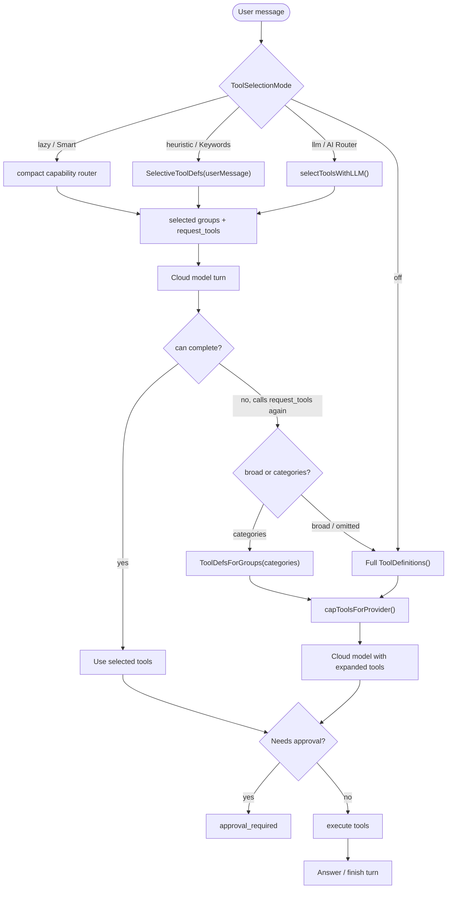

# Agent Tool Selection

Atlas has four tool-selection modes. The default **Smart** mode is now a compact hybrid:

1. Before the main turn, a fast background model routes the message against a small capability-group manifest instead of the full tool list.
2. Atlas injects only the tools for those selected groups, plus `request_tools`.
3. If the initial compact set is insufficient, the model can call `request_tools` again with `broad=true` or with `categories`.

This gets the right tools in front of the model sooner, without paying the token cost of sending every tool definition up front.

| Mode | Selection behavior |
| --- | --- |
| `lazy` / Smart | Uses a compact AI router to preselect capability groups, then keeps `request_tools` available as an escape hatch. |
| `heuristic` / Keywords | Injects `SelectiveToolDefs(userMessage)` before the main model turn. |
| `llm` / AI Router | Uses the compact AI router without `request_tools`. |
| `off` | Injects all tools; explicit opt-in only. |

## Request Tools Contract

`request_tools` accepts optional arguments:

- `broad: true` asks Atlas to send the broad/full tool surface.
- `categories: [...]` asks Atlas to send all tools in specific capability groups.

Supported categories:

- `automation`
- `communication`
- `workflow`
- `weather`
- `web`
- `finance`
- `office`
- `media`
- `mac`
- `shell`
- `files`
- `vault`
- `browser`
- `voice`
- `creative`
- `forge`
- `meta`

## Safety

Tool selection only changes what the model can see. It does not bypass:

- provider tool caps
- action approval policy
- workflow trust scope
- filesystem root restrictions
- bridge destination validation
