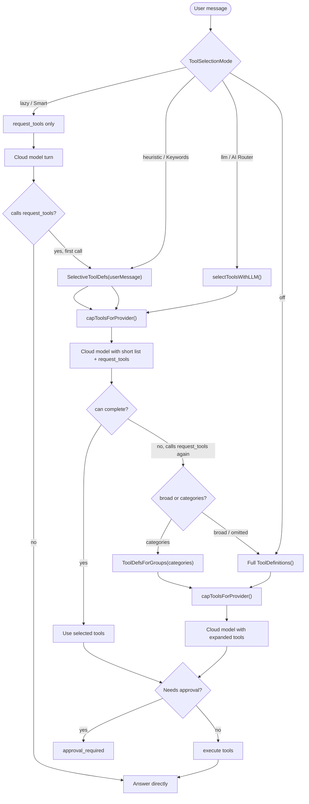

# Agent Tool Selection

Atlas has four tool-selection modes. The default **Smart** mode is staged:

1. The cloud model initially receives only `request_tools`.
2. If it needs tools, it calls `request_tools`.
3. Atlas answers with a short local `SelectiveToolDefs(userMessage)` list.
4. If that short list is insufficient, the model can call `request_tools` again with `broad=true` or with `categories`.
5. Atlas then returns either the requested categories or the broad/full tool surface, still subject to provider caps and action safety.

This keeps the cloud model from seeing every tool on ordinary turns, but also prevents it from getting stuck when the short list is too small.

| Mode | Selection behavior |
| --- | --- |
| `lazy` / Smart | Starts with `request_tools`; first request returns a short local list; second request can expand by category or broad list. |
| `heuristic` / Keywords | Injects `SelectiveToolDefs(userMessage)` before the main model turn. |
| `llm` / AI Router | Uses the Engine LM router or fast fallback provider to choose tools before the main model turn. |
| `off` | Injects all tools; explicit opt-in only. |

## Request Tools Contract

`request_tools` accepts optional arguments:

- `broad: true` asks Atlas to send the broad/full tool surface.
- `categories: [...]` asks Atlas to send all tools in specific capability groups.

Supported categories:

- `automation`
- `communication`
- `workflow`
- `weather`
- `web`
- `finance`
- `office`
- `media`
- `mac`
- `shell`
- `files`
- `vault`
- `browser`
- `voice`
- `creative`
- `forge`
- `meta`

## Safety

Tool selection only changes what the model can see. It does not bypass:

- provider tool caps
- action approval policy
- workflow trust scope
- filesystem root restrictions
- bridge destination validation
